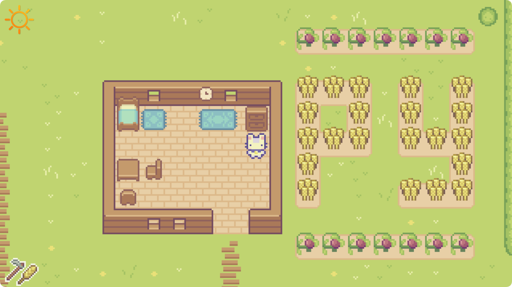

# PYDEW VALLEY GAME

    <em>
        Pydew Valley is a captivating simulation game inspired by the beloved Stardew Valley, offering players an enchanting and immersive farming experience. In the game, players can cultivate their own land, plant and harvest crops, gather fruits, and chop trees, all while adapting to changing weather and a dynamic day-night cycle. A bustling marketplace adds depth to the gameplay, allowing players to trade goods and expand their farming operations. With its focus on authentic farming mechanics and intuitive, streamlined gameplay, Pydew Valley masterfully recreates the tranquil beauty of rural life. It provides a relaxing yet engaging atmosphere, where players can lose themselves in the steady rhythm of nature. As they nurture their farms, they’ll experience the deeply rewarding sense of watching their efforts blossom and grow over time.
    </em>

